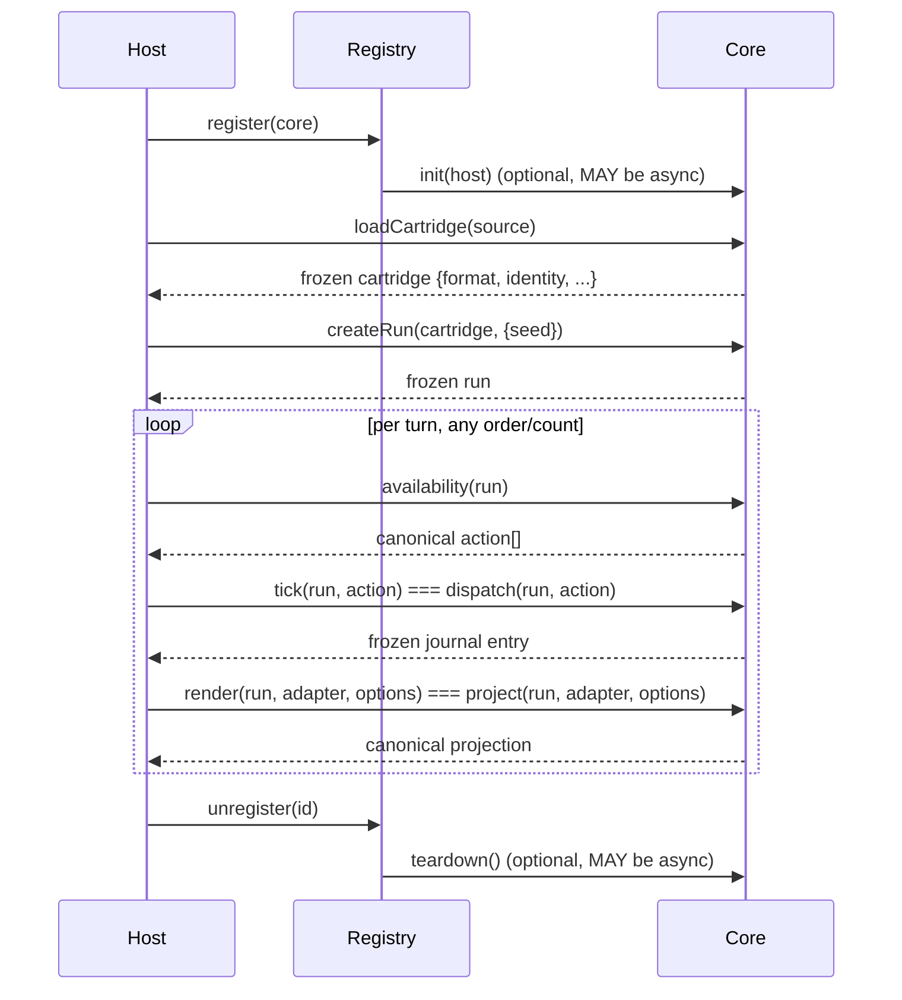

# Core Interface Specification

This document formally specifies Ludotape's pluggable core layer: the `ICore` interface, core
metadata and manifest formats, the loader/registry, conformance, and the versioning policy for
`ludotape/core@1`. It extends [SPEC.md](SPEC.md) and [ARCHITECTURE.md](ARCHITECTURE.md); where
this document is silent, their canonical-value, determinism, and trust rules apply unchanged.

## Vocabulary

A **core** is a frozen object implementing `ICore` that interprets one or more cartridge formats
and exposes the standard run lifecycle. A **cartridge** is unchanged from SPEC.md: a deeply frozen
rules/document snapshot with `format`, `identity`, and a digest-bound ruleset. **Core metadata** is
the deep-frozen canonical `metadata` member of a core describing its identity and capabilities. A
**manifest** (`core.manifest.json`) is on-disk, pre-import metadata used for discovery without
executing a core's entry module. A **registry** holds zero or more registered cores and resolves a
cartridge to the core that can run it. A **host** is the embedding application; it receives
`{log(...)}` at core initialization. **Lifecycle** is the ordered sequence of calls a host MUST
make against a core instance: registration, loading, running, and teardown. **Conformance** is
passing the automated suite in `test/core-conformance.mjs`, the operational definition of "a
core satisfies this specification."

## The `ICore` interface

A core is a frozen plain object. Hosts MUST NOT rely on prototype methods, getters, or symbols on
a core; only own enumerable data properties are part of the contract.

### Required members

| Member | Signature | Notes |
|---|---|---|
| `metadata` | canonical, deep-frozen object | see Core metadata schema below |
| `loadCartridge` | `(source) => cartridge` | MAY be async; `source` is a module namespace object or an already-compiled cartridge; MUST return a frozen cartridge with string `format` and `identity` fields |
| `createRun` | `(cartridge, {seed} = {}) => run` | mirrors `createRun` in `src/index.mjs` |
| `availability` | `(run) => action[]` | MUST return a canonical array |
| `dispatch` | `(run, action) => journalEntry` | MUST return a frozen journal entry; MUST throw a coded error (`E_ILLEGAL_ACTION` or an equivalent core-specific code) for an action not in `availability(run)` |
| `project` | `(run, adapter, options) => projection` | `adapter` and `options` are optional; MUST return a canonical projection |

### Optional members

| Member | Signature | Required when |
|---|---|---|
| `init` | `(host) => void` | never required; called once at registration if present. MAY be async |
| `teardown` | `() => void` | never required; called once at deregistration/shutdown if present. MAY be async |
| `isGoal` | `(run) => boolean` | `metadata.capabilities.solve === true` |
| `solve` | `(cartridge, options) => solveResult` | `metadata.capabilities.solve === true` |
| `createReplay` | `(run) => replay` | `metadata.capabilities.replay === true` |
| `verifyReplay` | `(cartridge, replay, options) => {ok, error?}` | `metadata.capabilities.replay === true` |
| `rewindRun` | `(run, turns) => run` | `metadata.capabilities.rewind === true` |

### Capability → method requirements

A declared capability MUST correspond to a working method; a core MUST NOT declare a capability it
does not implement, and MUST NOT omit a capability for a method it implements.

| Capability | Required methods | Absent when `false` |
|---|---|---|
| `replay` | `createReplay`, `verifyReplay` | methods MUST be absent or MUST throw a coded error if present but non-functional |
| `rewind` | `rewindRun` | as above |
| `solve` | `isGoal`, `solve` | as above |
| `scenarios` | none dedicated — declares that this core's cartridges are usable with `src/authoring.mjs` (`simulateActions`, `runScenario`, `checkCartridge`), which operates only through `availability`/`dispatch`/`project` | no additional method surface |

Registries and the conformance suite MUST verify this table for every registered/tested core
(see Conformance).

## Core lifecycle

A host drives a core through exactly this ordering. `init` runs at most once per core instance,
before any cartridge is loaded; `teardown` runs at most once, after which the instance MUST NOT be
reused.

`loadCartridge` and `createRun` MAY each be called multiple times against one core instance (new
cartridge, new run, or both) between `init` and `teardown`; the diagram's single pass repeats.

**Lifecycle aliases.** The loader adds `tick(run, action)` and `render(run, adapter, options)` to
every wrapped core as exact aliases of `dispatch` and `project` respectively. Cores MUST NOT
implement `tick` or `render` themselves; `wrapCore` attaches them, and a core-authored `tick`/
`render` property is ignored (overwritten) by the wrapper. Hosts MAY call either name; they are the
same function.

## Input/output contract

- Every value a core accepts as state, action, document, or option, and every value it returns as
  state, action, journal entry, or projection, MUST be a canonical value as defined in SPEC.md.
- `createRun`, `dispatch`, `rewindRun`, and any run object a core returns MUST behave under the
  same rules as `src/index.mjs`: run state and journal getters return copies, not live aliases.
- Determinism: a core's `initialState`-equivalent and transition logic MAY consume randomness only
  through the run's seeded RNG stream (`context.rng`, mirroring `createRng`), never through
  `Date.now`, `Math.random`, locale-sensitive APIs, network, filesystem, or other ambient I/O.
  `availability`, `project`, and `isGoal` are observational and MUST NOT consume or advance RNG
  state.
- Two `createRun(cartridge, {seed})` calls with the same cartridge and seed, followed by identical
  action sequences, MUST produce identical state digests and projections. Conformance verifies this
  with a determinism twin run.
- Journal entries returned by `dispatch`/`tick` MUST be deeply frozen and MUST carry enough
  information to support digest-based verification (before/after state digests at minimum, mirroring
  `src/index.mjs`'s journal shape).
- `metadata` and every value returned by `list()` MUST be deep-frozen canonical values; mutation
  attempts MUST fail silently or throw per normal `Object.freeze` semantics, never corrupt registry
  state.

### Error contract

Cores, the loader, and the registry throw `LudotapeError` (`code`, `message`, optional `details`)
for all coded failures. The core layer introduces the `E_CORE*` namespace, additive to the codes
already defined in `src/index.mjs`:

| Code | Thrown when |
|---|---|
| `E_CORE` | generic core-layer failure not covered by a more specific code |
| `E_CORE_METADATA` | `metadata` fails shape/canonicality validation (missing/invalid `format`, `id`, `version`, `name`, `capabilities`, or `cartridgeFormats`) |
| `E_CORE_SHAPE` | `wrapCore` receives a core failing `validateCoreShape` (missing required member, wrong type, malformed capability table) |
| `E_CORE_MANIFEST` | `core.manifest.json` is malformed, has unknown top-level keys, or its fields do not exactly match the loaded core's `metadata` |
| `E_CORE_ENTRY` | a manifest's `entry` module cannot be imported, or lacks a named `createCore` export |
| `E_CORE_DUPLICATE` | `register` is called with an `id` already present in the registry |
| `E_CORE_UNKNOWN` | `get(id)` (or any lookup) is called with an unregistered `id` |
| `E_CORE_CAPABILITY` | a declared capability's required method is missing or fails while exercised (registration- or conformance-time check) |
| `E_CORE_CARTRIDGE` | `resolve(cartridge)` finds no registered core for `cartridge.format`, or a core's `loadCartridge` receives an untrusted/unrecognized `source` shape |

Cores MUST NOT throw bare `Error`/`TypeError` for expected failure paths (bad action, bad
cartridge source, bad options); such inputs MUST produce a coded `LudotapeError`.

## Core metadata schema

`format: 'ludotape/core@1'` is the exact, versioned literal identifying this schema.

| Field | Type | Rule |
|---|---|---|
| `format` | string | MUST equal the literal `'ludotape/core@1'` |
| `id` | string | non-empty; MUST exactly match the manifest `id` when a manifest is present; SHOULD use a `scope/name` convention (e.g. `ludotape/js-ts-core`) |
| `version` | string | non-empty; SHOULD be a semantic version for compatibility tooling, but any non-empty string satisfies this schema |
| `name` | string | non-empty, human-readable |
| `description` | string | optional; if present alongside a manifest `description`, both MUST match exactly |
| `capabilities` | object | MUST contain exactly the four boolean keys `replay`, `rewind`, `solve`, `scenarios` — all four keys are REQUIRED regardless of their boolean value; no other keys permitted |
| `cartridgeFormats` | string[] | non-empty array of non-empty strings; each entry is a cartridge `format` literal this core can `loadCartridge` |

The whole `metadata` object MUST be a canonical value (per SPEC.md `canonical()`) and MUST be
deep-frozen, matching the frozen public-object convention used throughout `src/index.mjs`.

## Core manifest format

`core.manifest.json`, format `'ludotape/core-manifest@1'`, describes a core directory without
importing it — used by discovery, static validation, and CLI tooling.

| Field | Type | Rule |
|---|---|---|
| `format` | string | MUST equal `'ludotape/core-manifest@1'` |
| `id` | string | MUST exactly match the loaded core's `metadata.id` |
| `version` | string | MUST exactly match `metadata.version` |
| `name` | string | MUST exactly match `metadata.name` |
| `description` | string | optional; MUST match `metadata.description` if both are present |
| `entry` | string | relative path; MUST start with `./` |
| `capabilities` | object | MUST exactly match `metadata.capabilities` (same four keys, same values) |
| `cartridgeFormats` | string[] | MUST exactly match `metadata.cartridgeFormats` (same entries) |

A manifest MUST contain only the keys above; any unrecognized top-level key is rejected with
`E_CORE_MANIFEST`. A mismatch between any manifest field and the corresponding `metadata` field
after loading `entry` fails with `E_CORE_MANIFEST`.

### Entry-module convention

The module named by `entry` MUST export:

- a named `createCore()` factory — returns a fresh `ICore` instance; MUST be safe to call more
  than once (each call returns an independent instance, not a shared singleton);
- a `default` export — the `ICore` instance produced by exactly one `createCore()` call, provided
  as a convenience for direct `import` without invoking the factory.

Loading via manifest (`loadCoreFromManifest`) MUST call `createCore()` itself rather than trust the
`default` export, so that registries never share one mutable instance across independent
registrations.

## Registry and dynamic loading

`createCoreRegistry()` returns a frozen `{register, get, list, resolve, unregister}`.

- **`register(coreOrFactory)`** — accepts either an `ICore` instance or a `createCore`-shaped
  factory function (invoked with no arguments to obtain the instance). Validates shape
  (`validateCoreShape`), wraps it (`wrapCore`, attaching `tick`/`render`), calls `init(host)` if
  present (host = `{log(...)}`), and rejects a duplicate `metadata.id` with `E_CORE_DUPLICATE`.
  Returns the wrapped core.
- **`get(id)`** — returns the wrapped core for `id`; throws `E_CORE_UNKNOWN` if unregistered.
- **`list()`** — returns an array of canonical clones of every registered core's `metadata`, safe
  to inspect without exposing live core references.
- **`resolve(cartridge)`** — returns the first registered core whose `metadata.cartridgeFormats`
  includes `cartridge.format`; throws `E_CORE_CARTRIDGE` if none match. Registration order is
  resolution priority; a registry MUST NOT silently pick a later core over an earlier match.
- **`unregister(id)`** — removes the core from the registry, calling `teardown()` first if present.
  After `unregister`, `get(id)` MUST throw `E_CORE_UNKNOWN` for that `id`.

### Shape validation and wrapping

- **`validateCoreShape(core)`** — pure, synchronous, Node-independent; NEVER throws, including for
  non-object input. Always returns `{ok, diagnostics: [{severity, code, path, message}]}`. `ok`
  is `true` only when no diagnostic has `severity: 'error'`.
- **`wrapCore(core)`** — calls `validateCoreShape` first; throws `E_CORE_SHAPE` if `ok` is `false`;
  otherwise returns a frozen core with `tick`/`render` aliases attached.

### Discovery (Node-only, async)

- **`loadCoreFromManifest(manifestPath)`** — reads and validates `core.manifest.json`, imports
  `entry`, calls `createCore()`, cross-checks the result's `metadata` against the manifest field by
  field, and returns a wrapped core. Any failure produces one of the `E_CORE_MANIFEST`/
  `E_CORE_ENTRY` codes above.
- **`discoverCores(dirs)`** — scans each directory in `dirs` for immediate subdirectories
  containing `core.manifest.json`, loading each with `loadCoreFromManifest`. A single bad core MUST
  NOT abort discovery: failures become entries in the returned `diagnostics` array, not thrown
  errors. Returns `{cores, diagnostics}`.
- **`defaultRegistry`** — a `createCoreRegistry()` instance pre-populated with the built-in JS/TS
  core (`ludotape/js-ts-core`). Hosts MAY register additional cores into it or create an
  independent registry.

## Conformance

`test/core-conformance.mjs` exports `runCoreConformance(coreOrFactory, options)`
(`{cartridgeSource, seed = 0, maxSteps = 25}`), returning `{ok, passed, failed, results}`. At
minimum it checks: metadata shape and canonicality; `loadCartridge` produces a frozen cartridge
with `identity` and a `format` present in `metadata.cartridgeFormats`; `createRun` determinism
(same seed twice yields identical digest and projection); `availability` returns a canonical
array; `dispatch` of an available action advances turn and returns a journal entry with
before/after digests; `dispatch` of an illegal action throws a coded error; `project` returns a
canonical value; every declared capability cross-checked against the table above (replay
round-trips through `verifyReplay`, rewind reconstructs prior state, solve returns a status); and a
determinism twin run over up to `maxSteps` turns choosing the first available action each turn.

A core MUST pass `runCoreConformance` with `ok: true` to be considered conformant to this
specification. Passing conformance is necessary but not sufficient for production readiness — it
establishes contract compliance, not gameplay correctness or performance.

## Versioning and compatibility

`ludotape/core@1` and `ludotape/core-manifest@1` are the current, and so far only, format
literals. Within `@1`:

- New OPTIONAL members MAY be added to a future minor release of this document only if every
  existing conformant core remains valid without modification — i.e. the addition MUST NOT be
  observable by a core that does not implement it, and MUST NOT change the meaning of any existing
  required member.
- The manifest's "unknown top-level keys are rejected" rule is intentionally closed, not additive:
  a genuinely new *manifest* field requires either an explicit amendment to the fixed key list in
  this document (a spec revision, not a format bump) or a `ludotape/core-manifest@2` literal if the
  change is not universally backward-compatible with `@1` loaders.
- A new **major** format (`ludotape/core@2` / `ludotape/core-manifest@2`) is required, not
  optional, when: a required member's signature or return contract changes; a capability key is
  added, removed, or renamed in `capabilities`; the lifecycle ordering changes (e.g. a new
  mandatory call between `createRun` and `dispatch`); or an existing error code's meaning changes
  in a way that breaks existing `catch` logic keyed on `code`.
- `resolve(cartridge)` and `cartridgeFormats` already give hosts a forward-compatible seam: a
  registry MAY hold cores speaking different `cartridgeFormats` values simultaneously. The same
  pattern extends to core format literals themselves — a future loader MAY accept both
  `ludotape/core@1` and `ludotape/core@2` metadata side by side, keyed on the `format` field, without
  breaking `@1` cores.
- Cores and manifests MUST declare their format literal explicitly; there is no implicit default
  and no sniffing based on shape alone.

## Trust and scope

Cores are trusted JavaScript, identical in trust posture to cartridges and ruleset callbacks
(README.md, "Trust and scope"; ARCHITECTURE.md security boundary). Loading a core — whether via
direct `import`, `register`, or `loadCoreFromManifest` — executes arbitrary code with the authority
of the host realm. This specification defines shape, canonicality, and behavioral conformance; it
is **not** a sandbox, permission system, or security boundary. A malicious or buggy core can violate
every rule in this document; conformance checking catches accidental non-conformance, not adversarial
input.

**Non-goals** (in addition to SPEC.md's non-goals): sandboxing or isolating core code from the
host process; verifying a core's cartridge-format semantics beyond the `ICore` contract (a core
MAY faithfully implement a broken game); cross-core interoperability of run/journal internals
beyond the canonical projection and journal-entry shapes specified here; hot-swapping a core under
a live run (a run is bound to the core instance that created it — do not `register`/`unregister`
the same `id` while runs from the old instance are in use); and network- or process-based core
distribution (discovery is local filesystem only).
