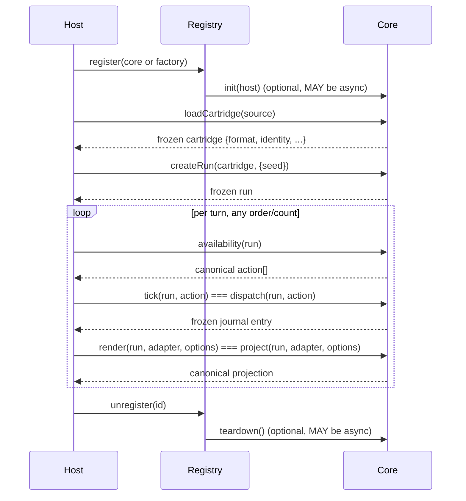

# Custom core reference

This is the complete reference for the custom-core system: the `ICore` interface member by member, the core metadata and manifest schemas, the loader/registry API in `src/core-loader.mjs` (package `ludotape/core`), the `tick`/`render` alias semantics, the lifecycle, and the conformance harness in `test/core-conformance.mjs` (package `ludotape/conformance`). It is the reference companion to the task-oriented [core authoring guide](core-authoring-guide.md); the normative source is the [core specification](../CORE_SPEC.md).

## Overview

A **custom core** interprets a cartridge format other than `ludotape/cartridge@1` while satisfying the same `ICore` contract, determinism rules, and canonical-value discipline as the built-in JS/TS core. The loader validates a core's shape, wraps it with lifecycle aliases, and registers it; a registry resolves a cartridge to the core that can run it. The conformance harness is the operational definition of a satisfying implementation.

## Prerequisites

- Node.js 20+. Zero dependencies.
- Read [Devkit and cores overview](devkit-overview.md) and the [core specification](../CORE_SPEC.md).
- Canonical values and determinism ([determinism contract](determinism-contract.md), [specification](../SPEC.md)) govern everything below.
- Source-checkout examples import `src/core-loader.mjs` and `test/core-conformance.mjs` by relative path; package consumers use `ludotape/core` and `ludotape/conformance`.

## ICore member contract

A core is a frozen plain object. Hosts rely only on own enumerable data properties — not prototype methods, getters, or symbols.

### Required members

| Member | Signature | Contract |
| --- | --- | --- |
| `metadata` | deep-frozen canonical object | See [Core metadata schema](#core-metadata-schema). |
| `loadCartridge` | `(source) => cartridge` | MAY be async. `source` is a module namespace object or an already-compiled cartridge. MUST return a frozen cartridge with string `format` and `identity` fields. Unrecognized `source` shapes MUST throw `E_CORE_CARTRIDGE`, never a bare `TypeError`. |
| `createRun` | `(cartridge, {seed} = {}) => run` | Mirrors `createRun` in `src/index.mjs`. Run state and journal getters MUST return copies, not live aliases. |
| `availability` | `(run) => action[]` | MUST return a canonical array of currently legal actions in deterministic order. Observational: no RNG consumption. |
| `dispatch` | `(run, action) => journalEntry` | MUST return a deeply frozen journal entry carrying at least before/after state digests. MUST throw a coded error (`E_ILLEGAL_ACTION` or an equivalent core-specific code) for an action not in `availability(run)`. |
| `project` | `(run, adapter, options) => projection` | `adapter` and `options` optional. MUST return a canonical projection. Observational: no RNG consumption. |

### Optional members

| Member | Signature | Required when | Notes |
| --- | --- | --- | --- |
| `init` | `(host) => void` | never | Called once at registration if present; `host` is `{log(...)}`. MAY be async. |
| `teardown` | `() => void` | never | Called once at deregistration/shutdown if present. MAY be async. |
| `isGoal` | `(run) => boolean` | `capabilities.solve === true` | Observational. |
| `solve` | `(cartridge, options) => solveResult` | `capabilities.solve === true` | Returns a status result. |
| `createReplay` | `(run) => replay` | `capabilities.replay === true` | — |
| `verifyReplay` | `(cartridge, replay, options) => {ok, error?}` | `capabilities.replay === true` | Non-throwing verification result. |
| `rewindRun` | `(run, turns) => run` | `capabilities.rewind === true` | Reconstructs a prior run; does not mutate input. |

### Capability → method matrix

A declared capability MUST correspond to a working method; a core MUST NOT declare a capability it does not implement, nor omit a capability for a method it implements. Registration and conformance enforce this and throw/report `E_CORE_CAPABILITY` on mismatch.

| Capability | Required methods | When `false` |
| --- | --- | --- |
| `replay` | `createReplay`, `verifyReplay` | methods absent, or present but throwing a coded error |
| `rewind` | `rewindRun` | as above |
| `solve` | `isGoal`, `solve` | as above |
| `scenarios` | none dedicated — declares the core's cartridges work with `ludotape/authoring` (`simulateActions`, `runScenario`, `checkCartridge`), which uses only `availability`/`dispatch`/`project` | no method surface |

## Core metadata schema

`format: 'ludotape/core@1'` is the exact schema literal. The whole object MUST be a canonical value and deep-frozen.

| Field | Type | Rule |
| --- | --- | --- |
| `format` | string | MUST equal `'ludotape/core@1'`. |
| `id` | string | Non-empty; MUST match the manifest `id`; SHOULD use a `scope/name` convention. |
| `version` | string | Non-empty; SHOULD be semantic, but any non-empty string satisfies the schema. |
| `name` | string | Non-empty, human-readable. |
| `description` | string | Optional; if present with a manifest `description`, both MUST match exactly. |
| `capabilities` | object | Exactly the four boolean keys `replay`, `rewind`, `solve`, `scenarios` — all four REQUIRED regardless of value; no other keys. |
| `cartridgeFormats` | string[] | Non-empty array of non-empty strings; each is a cartridge `format` literal this core can `loadCartridge`. |

## Core manifest (`core.manifest.json`)

Format `'ludotape/core-manifest@1'`. Describes a core directory without importing it — used by discovery, static validation, and CLI tooling.

| Field | Type | Rule |
| --- | --- | --- |
| `format` | string | MUST equal `'ludotape/core-manifest@1'`. |
| `id` | string | MUST match `metadata.id`. |
| `version` | string | MUST match `metadata.version`. |
| `name` | string | MUST match `metadata.name`. |
| `description` | string | Optional; MUST match `metadata.description` if both present. |
| `entry` | string | Relative path; MUST start with `./`. |
| `capabilities` | object | MUST match `metadata.capabilities` (same four keys, same values). |
| `cartridgeFormats` | string[] | MUST match `metadata.cartridgeFormats`. |

**Validation rules.** A manifest MUST contain only the keys above; any unrecognized top-level key is rejected with `E_CORE_MANIFEST`. Any mismatch between a manifest field and the corresponding `metadata` field after loading `entry` fails with `E_CORE_MANIFEST`.

### Entry-module convention

The module named by `entry` MUST export:

- a **named** `createCore()` factory — returns a fresh `ICore` instance; MUST be safe to call more than once (each call independent, not a shared singleton);
- a **`default`** export — the instance produced by exactly one `createCore()` call, for direct `import`.

`loadCoreFromManifest` calls `createCore()` itself rather than trust `default`, so registries never share one mutable instance.

## Loader and registry API

Exported from `src/core-loader.mjs` (package `ludotape/core`).

| Export | Signature | Returns / throws |
| --- | --- | --- |
| `validateCoreShape(core)` | `(core) => {ok, diagnostics}` | Pure, synchronous, Node-independent. NEVER throws, including for non-object input. `diagnostics` is an array of `{severity, code, path, message}`; `ok` is `true` only when no diagnostic has `severity: 'error'`. |
| `wrapCore(core)` | `(core) => core` | Runs `validateCoreShape` first; throws `E_CORE_SHAPE` if `ok` is `false`; otherwise returns a frozen core with `tick`/`render` aliases attached. |
| `createCoreRegistry()` | `() => {register, get, list, resolve, unregister}` | A frozen registry (see below). |
| `loadCoreFromManifest(manifestPath)` | async `(path) => core` | Reads and validates `core.manifest.json`, imports `entry`, calls `createCore()`, cross-checks metadata against the manifest field by field, returns a wrapped core. Throws `E_CORE_MANIFEST`/`E_CORE_ENTRY` on failure. Node-only. |
| `discoverCores(dirs)` | async `(dirs) => {cores, diagnostics}` | Scans each directory for immediate subdirectories containing `core.manifest.json` and loads each. A single bad core becomes a `diagnostics` entry, never a thrown error. Node-only. |
| `defaultRegistry` | registry instance | A `createCoreRegistry()` pre-populated with the built-in JS/TS core (`ludotape/js-ts-core`). Hosts MAY register additional cores or create an independent registry. |

### Registry members

| Method | Signature | Behaviour |
| --- | --- | --- |
| `register(coreOrFactory)` | `=> core` | Accepts an `ICore` instance or a `createCore`-shaped factory (invoked with no arguments). Validates shape, wraps it (attaching `tick`/`render`), calls `init(host)` if present (`host = {log(...)}`), and rejects a duplicate `metadata.id` with `E_CORE_DUPLICATE`. Returns the wrapped core. |
| `get(id)` | `=> core` | Returns the wrapped core; throws `E_CORE_UNKNOWN` if unregistered. |
| `list()` | `=> metadata[]` | Array of canonical clones of every registered core's `metadata`. Safe to inspect; exposes no live references. |
| `resolve(cartridge)` | `=> core` | Returns the first registered core whose `cartridgeFormats` includes `cartridge.format`; throws `E_CORE_CARTRIDGE` if none match. Registration order is resolution priority. |
| `unregister(id)` | `=> void` | Removes the core, calling `teardown()` first if present. Afterward `get(id)` throws `E_CORE_UNKNOWN`. |

### tick / render alias semantics

`wrapCore` attaches two aliases to every wrapped core:

- `tick(run, action)` is an exact alias of `dispatch(run, action)`.
- `render(run, adapter, options)` is an exact alias of `project(run, adapter, options)`.

Cores MUST NOT implement `tick` or `render` themselves; any core-authored `tick`/`render` property is ignored (overwritten) by the wrapper. Hosts MAY call either name — they are the same function.

## Lifecycle

A host drives a core through exactly this ordering. `init` runs at most once per instance before any cartridge is loaded; `teardown` runs at most once, after which the instance MUST NOT be reused. `loadCartridge` and `createRun` MAY each be called multiple times between `init` and `teardown`.



## Conformance harness

`test/core-conformance.mjs` (package `ludotape/conformance`) exports the dual-use harness.

```js
runCoreConformance(coreOrFactory, {cartridgeSource, seed = 0, maxSteps = 25} = {})
  // async → {ok, passed, failed, results: [{name, ok, message?}]}
```

| Option | Default | Meaning |
| --- | --- | --- |
| `cartridgeSource` | — | A module namespace or compiled cartridge the core can `loadCartridge`. |
| `seed` | `0` | Seed for the runs the harness creates. |
| `maxSteps` | `25` | Turns the determinism twin run plays, choosing the first available action each turn. |

Result shape: `{ok, passed, failed, results}` where `results` is an array of `{name, ok, message?}` and `ok` is `true` only when `failed === 0`.

Checks performed (at minimum):

| Check | Verifies |
| --- | --- |
| metadata shape/canonicality | `metadata` matches the schema and is a canonical, deep-frozen value. |
| `loadCartridge` | Produces a frozen cartridge with `identity` and a `format` present in `cartridgeFormats`. |
| `createRun` determinism | Same seed twice yields identical digest and projection. |
| `availability` | Returns a canonical array. |
| `dispatch` (available) | Advances turn and returns a journal entry with before/after digests. |
| `dispatch` (garbage) | Throws a coded error. |
| `project` | Returns a canonical value. |
| capability cross-checks | Each declared capability's methods exist and work: replay round-trips through `verifyReplay`; rewind reconstructs prior state; solve returns a status. |
| determinism twin run | Two runs over up to `maxSteps` first-available actions produce identical results. |

A core MUST pass with `ok: true` to be conformant. Passing establishes contract compliance, not gameplay correctness or performance. The bundled test `test/core-conformance.test.mjs` runs the harness against the JS/TS core, the custom-core template, and the stub core (plus deliberately broken/incomplete cores to verify the harness itself reports failure) under `node --test`.

```js
import {runCoreConformance} from '../test/core-conformance.mjs';       // package: 'ludotape/conformance'
import {createCore} from '../examples/cores/stub-core/core.mjs';
import * as cartridge from '../examples/cores/stub-core/stub-cartridge.mjs';

const result = await runCoreConformance(createCore, {cartridgeSource: cartridge, seed: 0, maxSteps: 25});
console.log(result.ok, result.passed, result.failed);
```

## Custom-core template walkthrough

`src/cores/custom-core-template/` is a copyable skeleton for hand-authoring a core. (`node devkit/create-core.mjs` does not copy this directory — it generates its own similar, self-contained document-driven-counter core fresh from `devkit/templates/`; see the [core authoring guide](core-authoring-guide.md#2-anatomy-of-the-generated-files).) It implements `ICore` for a minimal declarative JSON cartridge format `ludotape/custom-cartridge@1` (a document-driven counter-style ruleset) with `TODO` markers where you plug in your own format. It actually runs, so you can validate and conformance-check it before editing.

| File | Role |
| --- | --- |
| `core.mjs` | Heavily commented `ICore` skeleton; exports `createCore` and `default`. |
| `core.manifest.json` | Manifest for the template's id. |
| `types.d.ts` | Thin TypeScript declarations referencing the JS/TS core types or a minimal `ICore`. |
| `README.md` | How to copy and adapt. |

Copy this directory by hand (or run `node devkit/create-core.mjs` to generate a similar but separately-templated document-driven-counter core instead), change the `id`/`name`/`cartridgeFormats`, replace the format interpretation in `loadCartridge`/`createRun`/`availability`/`dispatch`/`project`, then validate and run conformance. The checked-in example `examples/cores/stub-core/` is a complete, conformance-passing instance to compare against.

## Troubleshooting

| Code | Cause | Fix |
| --- | --- | --- |
| `E_CORE` | Generic core-layer failure not covered by a more specific code. | Read `message`/`details`; a more specific code usually surfaces upstream. |
| `E_CORE_METADATA` | `metadata` failed shape/canonicality validation. | `format` must be `ludotape/core@1`; non-empty `id`/`version`/`name`; exactly four boolean capability keys; non-empty `cartridgeFormats`. |
| `E_CORE_SHAPE` | `wrapCore`/`register` received a core failing `validateCoreShape`. | Inspect `validateCoreShape(core).diagnostics`; implement the flagged member with the right type. |
| `E_CORE_MANIFEST` | Manifest malformed, has unknown top-level keys, or a field mismatches `metadata`. | Remove extra keys; make every field match `metadata`; ensure `entry` starts with `./`. |
| `E_CORE_ENTRY` | Entry module cannot be imported, or lacks a named `createCore` export. | Fix the import error; export a named `createCore` and a `default`. |
| `E_CORE_DUPLICATE` | `register` used an `id` already present. | Use a unique `id`, or `unregister(id)` first. |
| `E_CORE_UNKNOWN` | Lookup used an unregistered `id`. | Register first; verify the id via `list()`. |
| `E_CORE_CARTRIDGE` | `resolve` found no core for `cartridge.format`, or `loadCartridge` got an unrecognized `source`. | Add the format to `cartridgeFormats`, register a matching core, or pass a supported source. |
| `E_CORE_CAPABILITY` | A declared capability's required method is missing or failed while exercised. | Implement the method, or set the capability to `false`. |

## See also

- [Core specification](../CORE_SPEC.md) — normative source for every rule above.
- [Core authoring guide](core-authoring-guide.md) — step-by-step build.
- [JS/TS core reference](js-ts-core-reference.md) — the reference implementation.
- [SDK publishing guide](sdk-publishing-guide.md) — package and publish a core.
- [CLI reference](cli-reference.md) — `core` commands and devkit CLIs.
