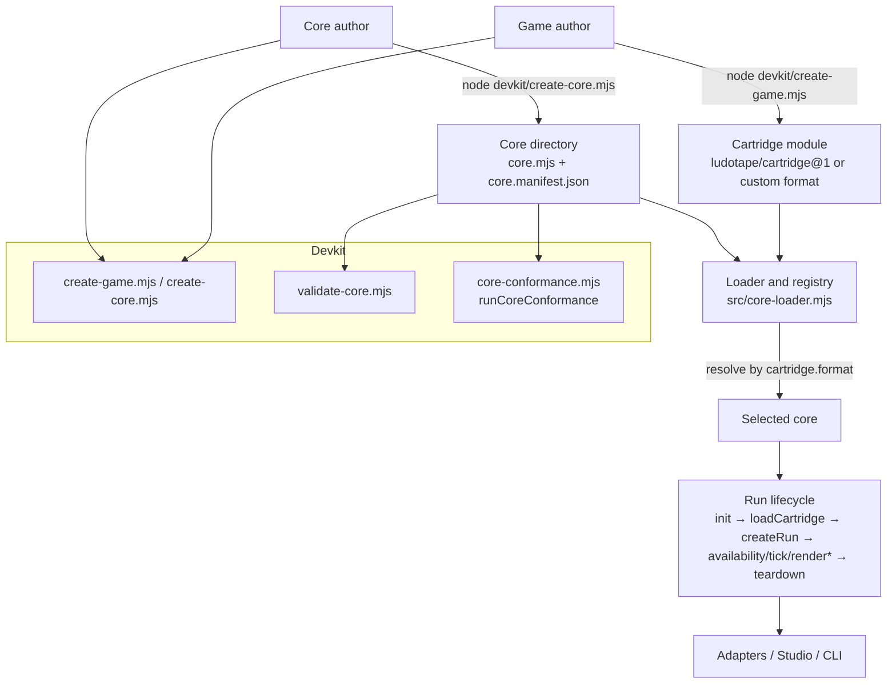

# Devkit and cores overview

Ludotape 0.2 adds a **devkit** (a software development kit) and a **pluggable core layer** on top of the 0.1 deterministic framework. This document explains what those pieces are, how they relate to the existing framework, and where each capability lives. It is the entry point for the [core specification](../CORE_SPEC.md) and the guides and references listed at the end.

Nothing here changes the 0.1 workflow. A game author who imports `defineGame`/`createRun` from `ludotape` and never touches a core is using the built-in JS/TS core implicitly, exactly as before. The devkit and the core layer are additive.

## Overview

Two ideas are introduced:

- **The core abstraction.** A *core* is a pluggable runtime that interprets one or more cartridge formats and exposes the standard run lifecycle behind a single interface, `ICore`. The built-in **JS/TS core** (`ludotape/js-ts-core`) is the reference implementation; it interprets `ludotape/cartridge@1` cartridges by delegating to the 0.1 core in `src/index.mjs`. A *custom core* can interpret any other cartridge format — a declarative JSON rules document, a different scripting shape — provided it satisfies the same `ICore` contract, determinism rules, and canonical-value discipline.
- **The devkit.** A set of scaffolders, validators, and a conformance harness that take a game author from an empty directory to a checked-in game, and a core author from an empty directory to a conformant, publishable core. The devkit is zero-dependency Node tooling built only on the existing public APIs.

A core is **trusted JavaScript**, identical in trust posture to cartridges and ruleset callbacks. Loading a core executes arbitrary code with the authority of the host realm. The core layer specifies shape, canonicality, and behavioral conformance; it is not a sandbox or a security boundary. See [Trust and scope](../CORE_SPEC.md#trust-and-scope).

## Prerequisites

- Node.js 20 or newer. The repository and the devkit have zero runtime and zero development dependencies.
- Familiarity with the 0.1 model: read [Getting started](getting-started.md) and the [game author guide](game-author-guide.md) first if you have not used Ludotape.
- Canonical values and determinism are load-bearing throughout. Review the [determinism contract](determinism-contract.md) and [specification](../SPEC.md).
- A source checkout is assumed for the examples below. Package consumers substitute package specifiers (see the subpath map).

## Architecture

Read the flow as: authors use devkit CLIs to produce a cartridge or a core; the loader/registry resolves a cartridge to the core that can run it; that core drives the run lifecycle; and the resulting canonical projections feed the existing adapters, Studio, and CLI. The lifecycle sequence, including the `tick`/`render` aliases, is specified in [Core lifecycle](../CORE_SPEC.md#core-lifecycle).

## Package subpath map

The `ludotape` package exposes these subpaths. Source-checkout code uses the relative `.mjs` path instead of the specifier.

| Import specifier | Resolves to | Purpose |
| --- | --- | --- |
| `ludotape` | `src/index.mjs` | Deterministic core: `defineGame`, `compileCartridge`, `createRun`, `dispatch`, `solve`, replay, RNG, canonical helpers. |
| `ludotape/core` | `src/core-loader.mjs` | Core loader and registry: `validateCoreShape`, `wrapCore`, `createCoreRegistry`, `loadCoreFromManifest`, `discoverCores`, `defaultRegistry`. |
| `ludotape/devkit` | `devkit/index.mjs` | Programmatic scaffolding/validation: `scaffoldGame`, `scaffoldCore`, `validateCore`. |
| `ludotape/js-ts-core` | `src/cores/js-ts-core/index.mjs` | Built-in JS/TS core: `createCore`, `default` core, and re-exported typed authoring helpers. |
| `ludotape/conformance` | `test/core-conformance.mjs` | Conformance harness: `runCoreConformance`. |
| `ludotape/authoring` | `src/authoring.mjs` | Authoring tools: `simulateActions`, `runScenario`, `runScenarios`, `checkCartridge`. |
| `ludotape/adapters` | `src/adapters.mjs` | View adapters: `semanticAdapter`, `canvasAdapter`, `terminalAdapter`. |
| `ludotape/storage` | `src/storage.mjs` | Opt-in repositories: memory, Web Storage, IndexedDB. |
| `ludotape/editor` | `src/editor.mjs` | Headless document draft history. |

The `.` and `./js-ts-core` entries also carry a TypeScript `types` condition pointing at the root declaration bundle `types/ludotape.d.ts`.

## How the pieces relate to the 0.1 framework

- The 0.1 public API in `src/index.mjs` is unchanged and remains the canonical implementation of the run lifecycle. The JS/TS core is a thin `ICore` façade over it, so behaviour, digests, and replays are identical whether you call `createRun` directly or through the core.
- The core layer adds a *dispatch seam*: `resolve(cartridge)` maps a `cartridge.format` to a registered core. With only the built-in core registered, that seam always selects the JS/TS core, so existing games need no changes.
- The authoring tools (`ludotape/authoring`) and adapters (`ludotape/adapters`) operate purely through `availability`/`dispatch`/`project`, so they work against any conformant core that declares the `scenarios` capability without modification.
- The CLI gains a `core` command group alongside the existing commands; the existing commands are byte-compatible.

## Troubleshooting

| Symptom | Likely cause | Fix |
| --- | --- | --- |
| `import 'ludotape/core'` fails to resolve | Using a package build that predates 0.2, or a source checkout (no package resolution). | In a source checkout import `src/core-loader.mjs` by relative path; as a package consumer upgrade to a build exposing the `./core` subpath. |
| A custom cartridge cannot be run through the default registry | Its `format` is not in any registered core's `cartridgeFormats`; `resolve` throws `E_CORE_CARTRIDGE`. | Register a core that lists the format, or use the JS/TS core with a `ludotape/cartridge@1` cartridge. See the [core authoring guide](core-authoring-guide.md). |
| Determinism differs between direct core calls and the loader | The loader only adds `tick`/`render` aliases; a difference means the core itself consumed ambient nondeterminism. | Audit the core for `Date.now`/`Math.random`/IO; use `context.rng` only. See [Input/output contract](../CORE_SPEC.md#inputoutput-contract). |
| TypeScript cannot find Ludotape types | The `types` condition is only wired for `.` and `./js-ts-core`. | Import types from `ludotape` or `ludotape/js-ts-core`; use the `devkit/tsconfig.template.json` starting point. |

## See also

- [Core specification](../CORE_SPEC.md) — normative `ICore`, manifest, loader, conformance, versioning.
- [Core authoring guide](core-authoring-guide.md) — zero-to-published-ready custom core.
- [JS/TS core reference](js-ts-core-reference.md) — full API of the built-in core and its author-facing surface.
- [Custom core reference](custom-core-reference.md) — loader, registry, manifest, and conformance API.
- [CLI reference](cli-reference.md) — every command including the `core` group and devkit CLIs.
- [SDK publishing guide](sdk-publishing-guide.md) — packaging a core as an npm module.
- [Game author guide](game-author-guide.md) — includes the "Multiple cores" section for game authors.
- [Documentation index](README.md).
